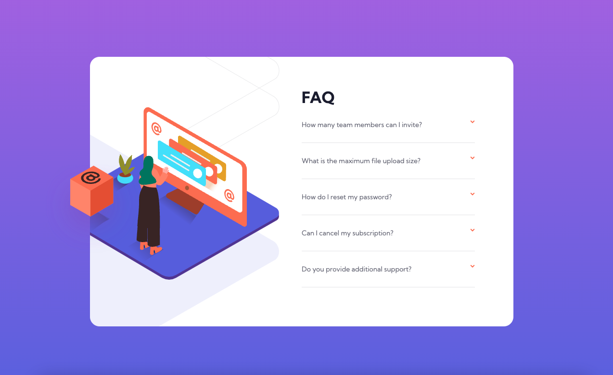

# Frontend Mentor - FAQ accordion card solution

This is a solution to the [FAQ accordion card challenge on Frontend Mentor](https://www.frontendmentor.io/challenges/faq-accordion-card-XlyjD0Oam). Frontend Mentor challenges help you improve your coding skills by building realistic projects. 

## Table of contents

- [Overview](#overview)
  - [The challenge](#the-challenge)
  - [Screenshot](#screenshot)
  - [Links](#links)
- [My process](#my-process)
  - [Built with](#built-with)
  - [What I learned](#what-i-learned)
  - [Continued development](#continued-development)
  - [Useful resources](#useful-resources)
- [Author](#author)

## Overview
Thank you for reviewing my code, I took a mobile first approach and decided to challenge myself and only use HTML and CSS to complete the challenge. The only downfall of this is that the slow transition when the details/summary drops down, the animation only works once. I was unable to find a solution for this that didnt involve javascript. So if you have one that would be greatly appreciated. 

### The challenge

Users should be able to:

- View the optimal layout for the component depending on their device's screen size
- See hover states for all interactive elements on the page
- Hide/Show the answer to a question when the question is clicked

### Screenshot




### Links

- Solution URL: https://github.com/timbosTours/FEM-FAQ-Accordian-card-CSS-only
- Live Site URL: https://timbostours.github.io/FEM-FAQ-Accordian-card-CSS-only/

## My process
Fortunately when I first began the challenge I noticed a FAQ at the bottom of the Frontend Mentor challenge page. I turned on dev tools to inspect and this was my first introduction to the Details & Summary HTML elements. Finding this gave me a good headstart and saved me a lot of time as I probably would have just started making divs. I styled the mobile layout first, added the drop down animation. I then moved on to desktop using Grid. I applied a 2 column layout to the faq-card in the media queries which made for easy styling. I had some trouble getting the orange box positioned. I found a solution and had to add another div as a wrapper so I could get the orange box to breakout of its parents while holding it's position.
### Built with

- Semantic HTML5 markup
- CSS custom properties
- CSS Grid
- Mobile-first workflow

### What I learned

I learned that it is possible to overwrite the overflow: hidden of a parent element.

```html
    <div id="wrapper">
```
```css
#wrapper{
    transform: scale(1);
}
```
I also had my first experience with the deetails and summary elements

```html
<details class="faq-details" id="faq-2"><summary class="faq-summary" id="summary-1">
    What is the maximum file upload size?</summary>
    <p class="faq-paragragh">No more than 2GB. All files in your account must fit your allotted storage space.</p></details>
```

I also learned that grid is a great way to make responsive layouts easily.

```css
#faq-card{
        min-width: 55rem;
        max-height: 35rem;
        display: grid;
        grid-template-columns: 50% 50%;
        padding-bottom: 0em;
        overflow: hidden;
    }
```

### Continued development

It was a good reminder to always look for the best possible html elements to achieve the desired layout. 

I enjoyed using grid and look forward to using it in more complex projects

### Useful resources

This video helped me stye the details/summary click down arrow.

- https://www.youtube.com/watch?v=PQtpZZQU0u0

This stack overflow solution helped me with the positioning of the orange box.

https://stackoverflow.com/questions/8837050/allow-specific-tag-to-override-overflowhidden

## Author

- Frontend Mentor - [@timbosTours]https://www.frontendmentor.io/profile/timbosTours
- Twitter - [@timbosTours](https://twitter.com/timbosTours
